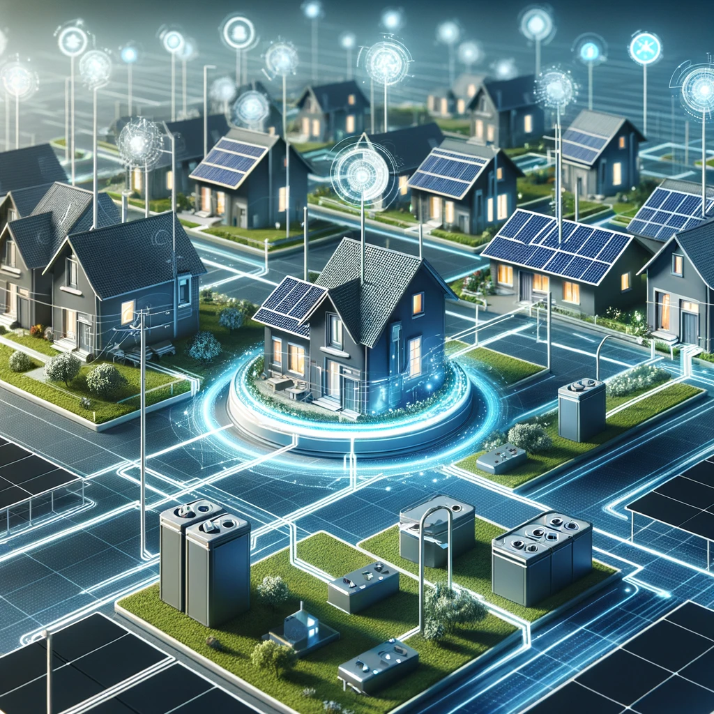

# YakuzAI Smart Grids

## Table of Contents
- [Overview](#overview)
- [Key Features](#key-features)
- [Table of Contents](#table-of-contents)
- [Getting Started](#getting-started)
  - [Prerequisites](#prerequisites)
  - [Installation](#installation)
- [Detailed Usage](#detailed-usage)
   - [Running the Script](#running-the-script)
- [Project Structure](#project-structure)
- [Customization Guide](#customization-guide)
- [How to Contribute](#how-to-contribute)
  - [Contributing Steps](#contributing-steps)
  - [Guidelines](#guidelines)
- [Community & Support](#community--support)
- [License](#license-)
- [Acknowledgments](#acknowledgments)

## Overview

YakuzAI's Smart Grid project is a project that aims to connect houses to batteries in a smart way. The project is part of the course Algorithms & Heuristics at the University of Amsterdam. The goal of the project is to connect houses to batteries in a smart way, so that the costs of the connections are as low as possible. This is done by using different algorithms and heuristics to test which one is the most efficient for connecting the houses to the batteries.


## Key Features

- **Reading the data**: Intelligently reading the data from the data sets.
- **Connecting the houses**: Connecting the houses to the batteries.
- **Calculating the costs**: Calculating the costs of the connections.
- **Plotting the results**: Plotting the results in a graph.

## Getting Started

### Prerequisites

- Python 3.6+
- Advanced understanding of Python
- Advanced knowledge of algorithms and machine learning
- New to Python? Check out [this guide](https://www.proglab.nl) to get started.

### Installation

1. **Clone the Repository**:
   ```bash
   git clone https://github.com/AntoniovanDijck/YakuzAI.git
   cd YakuzAI
   ```

2. **Install Dependencies**:
   ```bash
   pip install -r requirements.txt
   ```

## Detailed Usage

### Running the Script

```bash
python main.py
```

## Project Structure 

- `data/Huizen&Batterijen/`: Data sets for positions and battery capacities per district.
- `requirements.txt`: Dependencies.
- `main.py`: Main script.
- `helpers folder`: contains helper functions.
- `classes folder`: contains classes for houses, batteries and districts.
- `data folder`: contains data for the visualisation, output and input data.
- `demo.ipynb`: Jupyter notebook with a demo of the code.


## Customization Guide

| Variables              | Description                              |
| ---------------------- | ---------------------------------------- |
| Houses                 | Grid size, connections, etc.             | 
| Battery                | Battery capacities, Battery types.       | 
| Cables                 | length, types, Manhattan distance.       |
| Costs                  | Costs of the cables, batteries, etc.     |
| Districts              | Districts, houses, batteries, cables.    | 

## How to Contribute

### Contributing Steps

1. **Clone the Repository**
2. **Add Your Changes**
3. **Commit Your Changes**
4. **Push to the Branch**

### Guidelines

- Code must follow the project's style and standards.
- Clear, commented, and testable code is essential.
- Documentation updates are appreciated.

## Community & Support

- **Forum**: [Join discussions](https://student.uva.nl)
- **FAQs**: [Common questions](https://www.uva.nl/onderwijs/bachelor/inschrijven/doe-mee-aan-uva-matching/veelgestelde-vragen/veelgestelde-vragen.html)

## License 

This project is licensed under the UvA License - see the [LICENSE](https://uba.uva.nl/en/support/open-data/licences/licences.html) page for details.

## Acknowledgments

- Special thanks to all our contributors and the open-source community. 
